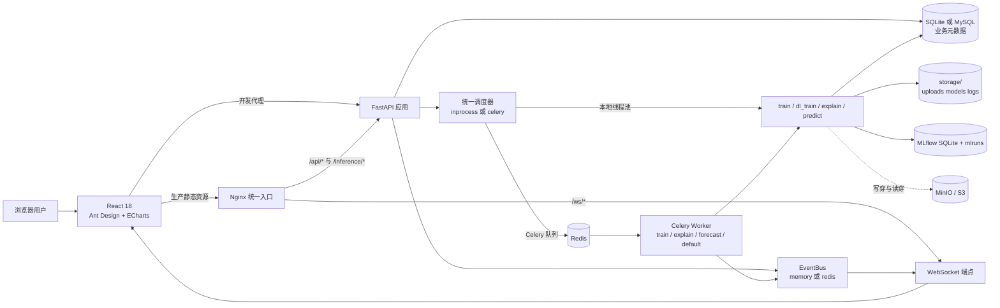
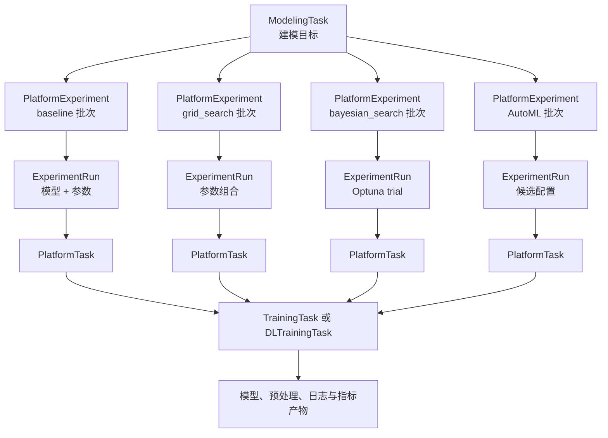
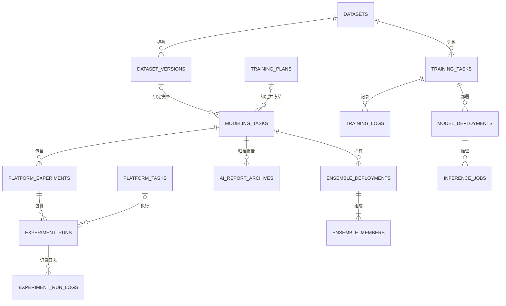
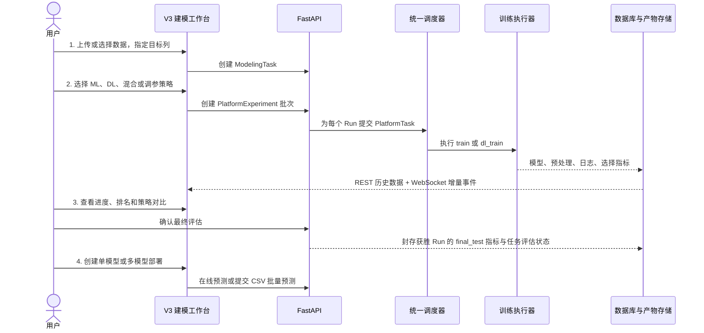
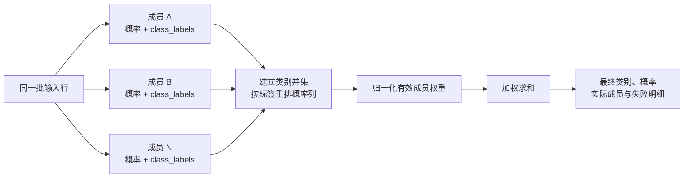
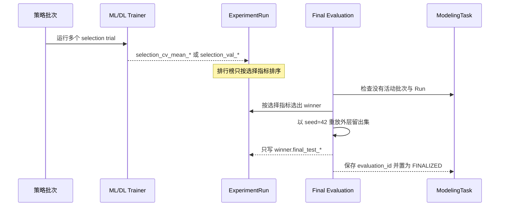
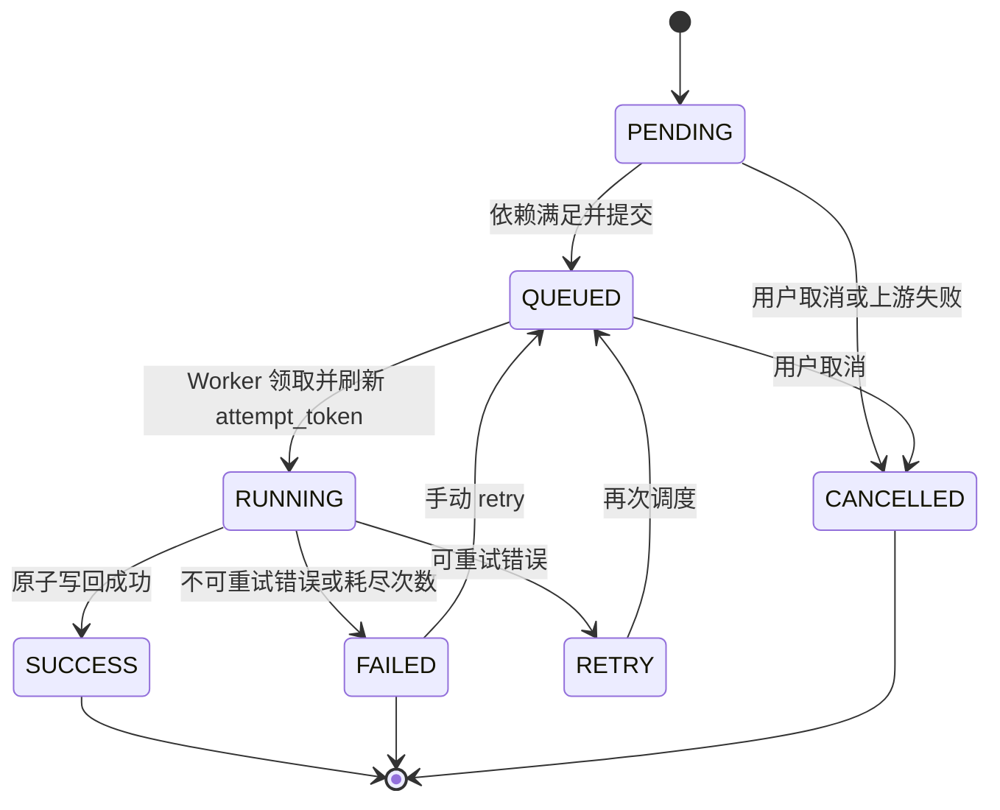

# 傻子也会训练模型：ML Learning Platform

一个面向表格数据建模的全流程平台：从数据导入与版本化开始，统一编排经典机器学习和深度学习训练，完成可复现的模型选择与最终评估，再把单模型或加权融合模型部署为在线推理服务。

> 本文依据当前仓库的后端路由、服务层、ORM、调度器、Alembic 迁移、React 页面、Docker 编排和近期提交记录整理。当前推荐入口是 V3 建模工作台；`/api/training`、`/api/dl` 等早期接口仍为兼容路径，并未删除。

## 目录

- [第一章 项目简介](#第一章-项目简介)
- [第二章 整体架构](#第二章-整体架构)
- [第三章 核心功能](#第三章-核心功能)
- [第四章 关键实现细节](#第四章-关键实现细节)
- [第五章 技术栈](#第五章-技术栈)
- [第六章 快速开始](#第六章-快速开始)
- [第七章 目录结构](#第七章-目录结构)
- [第八章 API 概览](#第八章-api-概览)
- [第九章 数据模型与迁移](#第九章-数据模型与迁移)
- [第十章 已知限制与后续工作](#第十章-已知限制与后续工作)

---

# 第一章 项目简介

## 1.1 平台解决什么问题

平台将一次建模工作定义为一个可追踪的研究过程，而不只是一次 `fit()` 调用。用户可以围绕同一数据集和目标列创建建模任务，执行 baseline、网格搜索、贝叶斯搜索或 AutoML 候选扫描，比较多个 Run 的选择分，显式确认最终模型，并继续完成解释、报告归档和部署。

平台主要面向两类读者：

- 使用者关心“数据是否可用、哪些模型跑过、训练是否稳定、最终效果如何、能否上线”；
- 维护者关心“任务如何拆分、状态由谁写回、评估是否泄漏、模型与预处理如何绑定、进程重启后怎样恢复”。

## 1.2 当前能力边界

| 能力域 | 已实现内容 | 主要代码入口 |
|---|---|---|
| 数据 | CSV、XLSX、Parquet 上传；预览、相关性、目标分布、内容哈希去重、版本快照、代码 Pipeline | `api/routes/data.py`、`services/data_service.py`、`services/data_version_service.py`、`services/data_pipeline_service.py` |
| 经典机器学习 | 分类与回归训练、交叉验证、模型比较、可视化、SHAP、部署与批量预测 | `core/trainer.py`、`services/training_service.py`、`services/viz_service.py` |
| 深度学习 | PyTorch MLP、LSTM、CNN1D、Transformer；Epoch 记录、早停信息、模型与预处理侧车文件 | `core/dl_trainer.py`、`services/dl_service.py` |
| 训练编排 | V3 建模任务、策略批次、Run、统一异步任务、依赖关系、重试与恢复 | `services/modeling_task_service.py`、`scheduler/` |
| 调参 | baseline、网格搜索、Optuna TPE 贝叶斯搜索、注册表驱动 AutoML | `services/tuning_service.py`、`registry/tuning_spaces.yaml`、`registry/automl_candidates.yaml` |
| 结果分析 | 训练日志、训练过程、回归回测、特征重要性、按需 SHAP、Run 诊断 | `components/results/`、`components/workbench/RunInspector.jsx` |
| 部署 | ML/DL 单模型部署、ML 异步 CSV 批量预测、ML/DL 加权融合推理 | `api/routes/deploy.py`、`services/deploy_service.py`、`services/ensemble_service.py` |
| 时序预测 | Chronos 兼容接口、统一 `/api/ts` 任务与部署接口 | `api/routes/timesfm.py`、`services/timeseries_service.py` |
| 报告 | 确定性 Markdown 报告、豆包 AI 报告、版本化归档和页面内阅读 | `services/report_service.py`、`services/ai_report_service.py`、`components/workbench/ReportView.jsx` |

经典机器学习注册表当前包含 15 个模型标识符：分类侧为 `random_forest`、`xgboost`、`lightgbm`、`logistic_regression`、`svm`、`mlp`；回归侧为 `random_forest_regressor`、`xgboost_regressor`、`lightgbm_regressor`、`linear_regression`、`ridge`、`lasso`、`elasticnet`、`svr`、`mlp_regressor`。深度学习注册表包含 `mlp_dl`、`lstm`、`cnn1d`、`transformer`。

---

# 第二章 整体架构

## 2.1 运行时架构

开发环境可以只运行 FastAPI、React 和 SQLite；生产编排则使用 MySQL 保存主元数据，Redis 同时承担 Celery Broker、结果后端和跨进程实时事件总线，MinIO 保存可恢复的对象副本。



虚线表示对象存储是可选的。`S3_ENABLED=false` 时，本地开发完全依赖 `ml_platform/storage/`；启用 MinIO 后，数据集、模型、日志、SHAP 和批量预测文件会保留对象副本，本地文件缺失时可按需恢复。

## 2.2 V3 领域层级

V3 把“研究目标”“策略批次”“一次尝试”和“异步执行”拆成四层，避免把模型、调参策略和调度状态塞进同一张任务表。

| 层级 | 含义 | 典型数量关系 | 核心表 |
|---|---|---|---|
| `ModelingTask` | 一个数据集、目标列和评价目标下的完整建模任务 | 1 | `modeling_tasks` |
| `PlatformExperiment` | 一种策略的一批实验，例如一批 grid search | 每个任务 0..N | `platform_experiments` |
| `ExperimentRun` | 一个模型和一组确定参数的一次训练尝试 | 每个批次 1..N | `experiment_runs` |
| `PlatformTask` | 可排队、重试、取消、恢复的异步工作单元 | 每个 Run 对应执行任务 | `platform_tasks` |

训练产生的真实 ML/DL 任务仍落在 `training_tasks` 或 `dl_training_tasks`，`ExperimentRun.domain_task_id` 将 V3 Run 与底层模型产物关联起来。



## 2.3 元数据关系

下图只保留主要物理外键。`modeling_tasks.dataset_id` 是便于查询的反规范化字段，并没有直接外键；若任务绑定了版本，则通过 `dataset_version_id` 关联 `dataset_versions`。



---

# 第三章 核心功能

## 3.1 数据管理与预处理

数据入口不只负责保存文件，还会计算基础结构信息并建立后续复现需要的标识。

1. 上传接口以流式方式写入临时文件，完成后原子替换，并计算 SHA-256；同一用户范围内可以按内容识别重复数据。
2. 服务支持 CSV、Excel 和 Parquet 的读取，页面提供数据预览、字段统计、相关性和目标分布。
3. `DatasetVersion` 保存版本号、父版本、内容哈希和存储 URI；相同内容不会机械地产生重复版本。
4. 代码 Pipeline 在短生命周期子进程中执行。代码获得 `df`、`pd`、`np`，必须写回 `df` 或 `result`；执行环境限制内建函数和导入，并受 `PIPELINE_CODE_TIMEOUT_S` 控制。
5. Pipeline 的输出不是覆盖原文件，而是创建新的 `Dataset`，因此原始输入仍可追溯。

相关分析接口会对大数据集做确定性抽样，避免为了一个图表把整个文件加载到浏览器；训练本身仍使用任务绑定的数据文件。

## 3.2 四步建模工作流

`ModelingWorkflow.jsx` 的实际用户流程由四步组成：导入数据、模型配置、训练过程、部署上线。



### 3.2.1 导入数据

用户可以选择已有数据集或上传新文件，查看预览后指定 `target_column`、`task_type` 和优化指标。创建建模任务时也可以绑定 `DatasetVersion` 和 `TrainingPlan`。

### 3.2.2 模型配置

配置区包含“机器学习”“深度学习”“混合策略”“调参策略”四个页签。ML、DL 和混合配置最终都通过同一个 V3 批次接口下发，不会绕开 Run 与调度层。代码配置入口允许用户生成一个 `config` 字典，再交回正常批次管线执行。

### 3.2.3 训练过程

训练页提供三个视角：

- “编排进度”展示任务、批次、Run 和调度任务的树形状态；
- “模型排名”按选择指标比较不同 Run，同时单独展示最终测试分；
- “策略对比”对比 baseline、grid search、Bayesian TPE 的结果分布。

### 3.2.4 部署上线

部署步骤分为“单模型部署”和“多模型部署”。单模型通过某个 Run 的 `domain_task_id` 桥接到 ML 或 DL 部署；多模型部署至少需要两个成员，并保存成员、家族、来源 Run、权重和模型类型。

## 3.3 训练策略与 Run 生成规则

| 策略 | Run 生成方式 | 实现要点 | 当前约束 |
|---|---|---|---|
| `baseline` | 每个选中模型运行一次，使用默认参数与覆盖项 | 最快得到横向基准 | ML、DL、混合均可用 |
| `grid_search` | 对每个模型的搜索空间做笛卡尔积 | 总量受 `max_trials` 截断 | 当前只支持 ML |
| `bayesian_search` | 每个模型建立独立 Optuna TPE Study，按 ask/tell 续跑 | 后续 trial 会利用此前结果 | 当前只支持 ML；训练种类交给 Celery 时会拒绝启动 |
| AutoML | 遍历注册表中的候选配置并走普通批次管线 | 候选配置不会仅按模型名折叠 | 受 `max_trials` 控制 |

批量接口 `POST /api/v3/tasks/{task_id}/experiments/bulk` 会先预检所有策略，全部可执行后才开始提交，避免前半批已经运行、后半批才因非法配置失败。当前前端的常规调参表单一次选择一种策略；多策略同发主要由 bulk API 提供。

一个真实的策略批次请求如下：

```http
POST /api/v3/tasks/{task_id}/experiments
Authorization: Bearer <token>
Content-Type: application/json
```

```json
{
  "name": "random-forest-grid",
  "strategy_type": "grid_search",
  "selected_models": ["random_forest"],
  "search_space": {
    "random_forest": {
      "n_estimators": [100, 200],
      "max_depth": [null, 10]
    }
  },
  "budget_config": {
    "max_trials": 4,
    "cv_folds": 5,
    "test_size": 0.2,
    "random_state": 42
  },
  "eval_metrics": ["accuracy", "f1"]
}
```

## 3.4 结果工作台

完成任务统一进入 `/training/results`。ML 与 DL 共用 `UnifiedResultDetail` 外壳，并由 `resultViewRegistry.js` 根据模型家族、任务类型、状态和能力动态决定页签。

| Tab | 回答的问题 | 展示内容 | 可见条件 |
|---|---|---|---|
| 训练日志 | 运行时发生了什么？ | 历史日志、实时增量、搜索、过滤、暂停、下载 | 所有状态，默认第一个 |
| 训练可视化 | 模型是怎样训练的？ | ML 学习曲线、交叉验证均值/标准差/变异系数；DL Epoch loss、指标和早停位置 | 成功的分类或回归任务 |
| 结果回测 | 预测和真实值对不对得上？ | 回归：实际值/预测值曲线、`y=x` 散点、残差图、RMSE/MAE/MAPE；分类：混淆矩阵、ROC 曲线 | 训练成功的任务 |
| 模型解释 | 哪些特征影响预测？ | 原生特征重要性；按需计算 SHAP | 成功且可解释的分类或回归任务 |

`RunInspector.jsx` 是列表场景下的快速抽屉，仍保留组合式 `TrainingViz`，用于一次查看多个结果图；正式结果详情页则把训练过程、预测效果和解释拆开，避免概念混杂。

## 3.5 模型部署与推理

### 3.5.1 单模型

ML 单模型部署使用 `/api/deploy/{task_id}` 创建部署，在线推理位于不带 `/api` 前缀的 `/inference/{deployment_id}/predict`。一次同步请求示例：

```json
{
  "rows": [
    {
      "age": 42,
      "monthly_spend": 318.5,
      "region": "east"
    }
  ],
  "include_probabilities": true
}
```

部署页会根据真实数据预览生成输入契约示例，并移除目标列。模型产物使用 `TabularModelArtifact` 绑定已拟合预处理器和目标编码器，因此推理输入仍可使用原始类别字符串，而不是要求调用方重做训练时编码。

ML 批量预测接收 CSV，先返回 Job ID，再由 `predict` 类型的 `PlatformTask` 分块处理；状态接口返回已处理行数，完成后才能下载结果文件。DL 部署有独立的 `/api/dl/deployments/*` 路由，目前不复用这套 CSV 批量接口。

### 3.5.2 多模型加权融合

分类融合不能假设所有成员的概率第 `i` 列都代表同一个类别。服务会读取每个成员自己的 `class_labels`，先建立类别并集并对齐列，再进行加权求和。



推理时允许个别成员失败：只要至少两个成员成功，服务会对幸存成员重新归一化权重，并在响应中报告失败成员和实际权重。整个融合计算通过 `asyncio.to_thread` 离开事件循环；成员在同一工作线程中顺序运行，以免 XGBoost、LightGBM 等内部线程池叠加造成 CPU 过度订阅。

## 3.6 实时日志与进度

实时端点为 `/ws/training/{task_id}` 和 `/ws/logs/{task_id}`。浏览器 WebSocket 无法自定义 `Authorization` 请求头，因此启用鉴权时 Token 放在 `?token=` 查询参数中；握手还会校验任务所有权。

前端 `useLogStream` 会先用 REST 读取历史日志，再追加 WebSocket 增量，断线后按 1、2、4 秒递增并封顶 10 秒重连，最多在内存中保留 2000 条。后端 `TrainingLogger` 同时写文件、指标 JSON、事件总线和数据库，数据库日志按数量或时间批量刷新。

开发环境的内存 EventBus 使用线程安全的 `call_soon_threadsafe`；生产 Compose 明确使用 Redis EventBus，使 Backend、Worker 和 WebSocket 可以跨进程传递事件。

## 3.7 报告与归档

建模任务可以生成确定性 Markdown 报告，也可以在配置豆包/Ark 凭据后生成 AI 报告。AI 报告不是临时弹窗内容：`ai_report_archives` 保存 Markdown、结构化 payload、模型来源和创建时间，任务报告页优先展示最新 AI 归档，旧的基础 Markdown 作为回退。新报告生成后，页面内阅读区会直接刷新，不要求手动重载。

---

# 第四章 关键实现细节

## 4.1 选择分与最终测试分分离

V3 训练统一以 `evaluation_mode=selection` 执行。选择阶段只写入 `selection_cv_mean_*` 或 `selection_val_*` 等选择指标，不把外层测试集分数混进排行榜。用户调用 `POST /api/v3/tasks/{task_id}/final-evaluation` 后，服务才执行一次最终评估：

1. 拒绝仍有活动 Experiment 或 Run 的任务；
2. 以选择指标决定获胜 Run，而不是偷看测试分；
3. 获取带 `evaluation_id` 的评估声明，防止并发重复封存；
4. 以固定随机种子 42 重放外层切分；
5. 只给获胜 Run 写入 `final_test_*`，并将任务快照中的最终评估状态置为 `FINALIZED`；
6. 相同输入重复调用时返回同一评估结果，保持幂等。

这里的“封存测试集”是由数据版本、切分配置和固定随机种子可重放的逻辑留出集，并不是单独复制出来的一份测试文件。



DL 最终评估还会校验预处理侧车文件；缺失时不会拿裸 `.pt` 权重猜测输入缩放方式。

## 4.2 统一调度与写回契约

`app/scheduler/` 将“排队方式”和“业务执行器”分离。执行器注册表按 `kind` 装载 `train`、`dl_train`、`explain`、`predict` 等模块；`InProcessScheduler` 用本地线程池，`CeleryScheduler` 把任务发往对应队列。`SCHEDULER_MODE` 可以全局切换，`CELERY_KINDS` 还允许只把指定种类交给 Celery。

无论任务在哪个进程执行，最终都收敛到 `run_writeback.complete_platform_task`：它在一个数据库事务中条件更新 `PlatformTask` 和关联 `ExperimentRun`，负责重试停泊、依赖传播、批次收口和最佳 Run 更新。写回使用 `attempt_token` 区分当前执行尝试，恢复扫描不会把刚被其他 Worker 重新领取的任务误判为陈旧任务。



启动阶段会重新提交“数据库已是 QUEUED、但没有可靠 Broker 交付”的任务；后台恢复扫描还会重新驱动超过阈值仍未终结的任务。这是 at-least-once 恢复模型，所以写回必须幂等，而不能假设执行器永远只运行一次。

## 4.3 训练方案采用“实时引用 + 不可变快照”

`TrainingPlan` 是与数据集无关的可复用训练配方，保存任务类型、策略、模型列表、搜索空间、DL 配置、预算和默认指标。建模任务绑定方案时同时保存：

- `training_plan_id`：用于跳回当前方案，方案删除时置空；
- `training_plan_snapshot`：创建时冻结的完整 payload、版本和 DAG 形状。

因此后续编辑方案不会改写历史任务。调度和报告读取任务快照，而不是再次解释“当前版本”的方案。

## 4.4 模型产物包含预处理契约

经典 ML 不只保存 estimator。`TabularModelArtifact` 将 estimator、已拟合预处理器、目标编码器、特征列顺序和产物版本打包在一起。数值列使用训练期中位数填补，类别映射中的未知值落到 `-1`；分类预测可恢复原始类别标签。

DL 将权重和预处理信息分开保存，推理与最终评估必须同时拿到 checkpoint 和侧车文件。这个约束防止出现“模型加载成功但缩放方式不同，结果仍看似合理”的隐蔽错误。

## 4.5 可视化采用声明式注册表

`components/viz/vizRegistry.js` 不按具体模型名写大段条件分支，而是为每种图声明：

- 支持的 `taskType` 和 `family`；
- 属于哪个 `resultsTabs`；
- 是否用于 Workbench；
- 能力要求和加载策略。

混淆矩阵、ROC、PR、逐类指标、学习曲线、预测/真实值、特征重要性、SHAP、阈值、校准和预测分布都由注册表筛选。预期的能力缺失，例如非线性 SVR 没有原生 `feature_importances_`，会显示中性说明而不是被当作系统故障。

## 4.6 缓存与对象恢复

| 缓存/恢复点 | 键与容量 | 作用 | 一致性依据 |
|---|---|---|---|
| 部署模型 LRU | `deployment_id`，最多 10 个 | 避免每次在线推理都重新加载模型 | 删除部署时主动逐出 |
| 可视化 prepared bundle LRU | `(task_id, stratified)`，最多 4 个 | 复用模型、数据切分和留出数组 | 已完成任务的产物不可变，重训产生新 ID |
| SHAP 摘要缓存 | 任务指标 + `max_samples` | 避免重复执行昂贵解释 | 样本数变化或 `refresh=true` 时重算 |
| 对象存储读穿 | 对象 URI / 约定 Key | 本地数据集、模型、日志、侧车、批量结果缺失时恢复 | 临时文件下载完成后原子替换 |

SHAP 重计算通过 `asyncio.to_thread` 离开事件循环，解释器按 Tree、Kernel、排列重要性逐级回退。完整逐样本 SHAP payload 可写入对象存储，Run 行只保留紧凑摘要。

对象上传采用写穿但属于尽力而为；为了避免对象存储故障拖垮主请求，上传侧有短时熔断。主元数据仍以数据库为准，本地产物仍是执行器首先写入的位置。

## 4.7 多用户所有权与生产启动门禁

迁移 `0007` 为主要业务实体补充 `owner_username`。REST 通过 Bearer Token 获取当前用户，列表和详情服务按 owner 限定；WebSocket 在握手阶段重复执行 Token 与任务归属校验。

`ENVIRONMENT=production` 时，应用会在建表、种子数据和后台任务启动前校验数据库、鉴权和对象存储配置。生产 Compose 使用独立的一次性 `migrate` 服务运行 `ensure_alembic_baseline.py` 和 `alembic upgrade head`，Backend 与 Worker 只有在迁移成功后才启动，避免 ORM 代码先连接到落后一版的 Schema。

---

# 第五章 技术栈

| 层 | 技术 |
|---|---|
| 前端 | React 18、Vite 5、React Router 6、Redux Toolkit、Ant Design 5、ECharts 5、Axios |
| API | FastAPI、Pydantic v2、Uvicorn、WebSocket |
| 数据访问 | SQLAlchemy 2 Async、aiosqlite、aiomysql、Alembic |
| 经典 ML | scikit-learn、XGBoost、LightGBM、Optuna、SHAP |
| 深度学习 | PyTorch 2.6 |
| 时序 | statsmodels、Chronos 兼容服务 |
| 实验与产物 | MLflow、joblib、本地文件系统、boto3、MinIO/S3 |
| 调度与实时 | 本地 ThreadPoolExecutor、Celery、Redis Pub/Sub |
| 测试 | pytest、pytest-asyncio、Vitest、Playwright |
| 生产运行 | Python 3.11、Node.js 20、MySQL 8、Redis 7、Nginx、Docker Compose |

---

# 第六章 快速开始

## 6.1 本地开发

### 6.1.1 前置条件

- Python 3.11；
- Node.js 20 与 npm；
- 仅当启用 Celery/Redis EventBus 时才需要 Redis；
- 仅当启用 S3 兼容对象存储时才需要 MinIO。

### 6.1.2 启动后端

后端从 `ml_platform/.env` 和 `ml_platform/.env.local` 读取配置。建议把个人开发覆盖写在已忽略的 `.env.local` 中；下面的配置使用 SQLite、本地调度和内存事件总线，不依赖 MySQL、Redis 或 MinIO。

```bash
cd ml_platform
python -m venv .venv
source .venv/bin/activate
python -m pip install --upgrade pip
pip install -r requirements.txt

test -f .env.local || cp .env.example .env.local
```

确认 `ml_platform/.env.local` 至少包含：

```dotenv
ENVIRONMENT=development
DATABASE_URL=sqlite+aiosqlite:///./storage/ml_platform.db
SCHEDULER_MODE=inprocess
EVENT_BUS_MODE=memory
S3_ENABLED=false
AUTH_ENABLED=false
MLFLOW_TRACKING_URI=sqlite:///./storage/mlflow.db
```

启动服务：

```bash
python -m uvicorn app.main:app --reload --host 127.0.0.1 --port 8000
```

开发/测试环境会执行 `Base.metadata.create_all` 和兼容启动迁移；生产环境的 Schema 只能由 Alembic 管理。

### 6.1.3 启动前端

另开终端：

```bash
cd ml_platform_web
npm install
npm run dev
```

Vite 默认监听 `http://127.0.0.1:3000`，并把 `/api`、`/inference` 和 `/ws` 代理到 `http://127.0.0.1:8000`。需要改后端端口时，可在 `ml_platform_web/.env.local` 中设置：

```dotenv
VITE_API_TARGET=http://127.0.0.1:8001
```

可用入口：

| 入口 | 地址 |
|---|---|
| 前端 | <http://127.0.0.1:3000> |
| 健康检查 | <http://127.0.0.1:8000/health> |
| Swagger UI | <http://127.0.0.1:8000/docs> |
| OpenAPI JSON | <http://127.0.0.1:8000/openapi.json> |

Windows PowerShell 也可以在依赖已安装后从仓库根目录运行：

```powershell
./scripts/start-dev.ps1
```

## 6.2 Docker Compose 生产栈

生产编排位于 `docker/docker-compose.yml`，包含 MySQL、Redis、MinIO、`minio_init`、`migrate`、Backend、Worker、Frontend 和 Nginx。

生产模式会拒绝空的鉴权密钥。首次启动前创建 `docker/.deploy_secrets`，至少设置自己的数据库、对象存储和鉴权凭据；不要沿用 Compose 中的开发默认值。

```dotenv
MYSQL_ROOT_PASSWORD=<strong-password>
MYSQL_DATABASE=ml_platform
DATABASE_URL=mysql+aiomysql://root:<url-encoded-password>@mysql:3306/ml_platform

S3_ACCESS_KEY=<minio-access-key>
S3_SECRET_KEY=<strong-minio-secret>
S3_BUCKET=ml-platform

AUTH_ENABLED=true
AUTH_USERNAME=admin
AUTH_PASSWORD=<strong-admin-password>
AUTH_SECRET_KEY=<64-hex-secret>
```

可以用以下命令生成应用签名密钥：

```bash
python -c "import secrets; print(secrets.token_hex(32))"
```

构建并启动：

```bash
cd docker
docker compose up -d --build
docker compose ps
docker compose logs -f backend worker
```

Compose 中 Nginx 的默认公开端口是 `18081`，因此统一入口为 <http://127.0.0.1:18081>。也可以在启动前设置 `PUBLIC_HTTP_PORT`。Backend、Frontend、MySQL、Redis 和 MinIO 的直连端口只绑定到 `127.0.0.1`。

停止服务但保留 Volume：

```bash
docker compose down
```

`docker compose down -v` 会删除 MySQL、Redis、MinIO 和后端存储 Volume，属于数据清理操作，请只在明确需要重置环境时执行。

## 6.3 数据库迁移

```bash
cd ml_platform
alembic upgrade head
alembic current
```

对于 Alembic 接管前已经由 ORM 建好的库，部署脚本使用 `scripts/ensure_alembic_baseline.py` 识别并建立基线，再执行升级。不要同时维护 SQL 初始化快照和 Alembic；当前 Compose 已明确以 Alembic 为唯一 Schema 事实源。

## 6.4 测试与构建

后端：

```bash
cd ml_platform
DATABASE_URL=sqlite+aiosqlite:///./test.db S3_ENABLED=false \
  python -m pytest tests/ -q --tb=short
```

前端：

```bash
cd ml_platform_web
npm install
npm run lint
npm run test:unit
npm run build
```

根目录 Playwright 配置会自动在 `8100` 和 `3100` 启动隔离的后端与前端；SQLite 下默认使用单 Worker，避免并行写导致 `database is locked`。

```bash
cd ..
npm install
npx playwright install chromium
npx playwright test --project=chromium
```

## 6.5 常用配置

| 配置项 | 默认/示例 | 用途 |
|---|---|---|
| `ENVIRONMENT` | `development` | `production` 会启用严格配置校验 |
| `DATABASE_URL` | SQLite 开发 URL | SQLAlchemy Async 数据库连接 |
| `SCHEDULER_MODE` | `inprocess` | `inprocess` 或 `celery` |
| `CELERY_KINDS` | 空 | 仅把指定 kind 交给 Celery |
| `EVENT_BUS_MODE` | `memory` | `memory` 或 `redis`；多进程应使用 Redis |
| `REDIS_URL` | `redis://localhost:6379/0` | EventBus Redis 连接 |
| `CELERY_BROKER_URL` | Redis DB 0 | Celery Broker |
| `CELERY_RESULT_BACKEND` | Redis DB 1 | Celery 结果后端 |
| `MLFLOW_TRACKING_URI` | `sqlite:///./storage/mlflow.db` | MLflow 元数据 |
| `MAX_UPLOAD_SIZE` | `209715200` | 上传上限，默认 200 MiB |
| `S3_ENABLED` | `false` | 是否启用 MinIO/S3 写穿与读穿 |
| `S3_ENDPOINT_URL` | 无 | S3 兼容端点 |
| `USER_CODE_TIMEOUT_S` | `5` | 模型代码配置执行超时 |
| `PIPELINE_CODE_TIMEOUT_S` | `60` | 数据 Pipeline 子进程超时 |
| `AUTH_ENABLED` | 生产默认开启 | Bearer Token 鉴权开关 |
| `AUTH_USERS_JSON` | 无 | 可选多用户凭据配置 |
| `ARK_API_KEY` / `DOUBAO_API_KEY` | 无 | AI 报告服务凭据 |

---

# 第七章 目录结构

```text
ML_learning_platform/
├── CLAUDE.md                         # 项目约定与历史结构说明
├── README.md                         # 本文档
├── examples/data/                    # 首次启动可导入的示例 CSV
├── ml_platform/                      # FastAPI 后端
│   ├── alembic/
│   │   └── versions/                 # 0001..0008 Schema 迁移
│   ├── app/
│   │   ├── api/
│   │   │   ├── routes/               # REST 路由
│   │   │   └── websocket.py          # 实时训练与日志通道
│   │   ├── core/                      # ML/DL Trainer、日志、鉴权
│   │   ├── models/
│   │   │   ├── database.py           # SQLAlchemy ORM
│   │   │   └── schemas.py            # Pydantic Schema
│   │   ├── scheduler/                 # 调度、执行器、Celery、写回与恢复
│   │   ├── services/                  # 业务服务
│   │   └── main.py                    # 应用生命周期与路由注册
│   ├── registry/                      # 调参空间与 AutoML 候选注册表
│   ├── scripts/                       # Alembic 基线等后端脚本
│   ├── storage/                       # 运行期 uploads/models/logs/DB
│   ├── tests/                         # pytest
│   ├── .env.example                   # 后端配置模板
│   └── requirements.txt
├── ml_platform_web/                  # React 前端
│   ├── src/
│   │   ├── components/
│   │   │   ├── results/              # 统一结果页四类视图
│   │   │   ├── viz/                  # ECharts 图表与可视化注册表
│   │   │   └── workbench/            # V3 编排、Run、报告、部署组件
│   │   ├── pages/                     # 页面与工作流入口
│   │   └── services/api.js            # Axios REST/Inference 客户端
│   ├── package.json
│   └── vite.config.js
├── docker/
│   ├── docker-compose.yml             # 生产服务编排
│   ├── Dockerfile.backend
│   ├── Dockerfile.frontend
│   └── nginx.conf
├── scripts/                           # 开发启动、部署与热更新脚本
├── tests/                             # 根目录 Playwright E2E
└── .github/workflows/                 # pytest、前端、迁移和里程碑门禁
```

---

# 第八章 API 概览

除 `/health`、`/inference/*` 和 `/ws/*` 外，业务 REST API 统一挂载在 `/api` 下。

| 路由组 | 关键路径 | 说明 |
|---|---|---|
| 鉴权 | `POST /api/auth/login`、`GET /api/auth/me` | 登录换取 Bearer Token、读取当前身份 |
| 数据 | `/api/data/upload`、`/api/data/{id}/preview`、`/pipeline`、`/versions` | 上传、分析、代码处理与版本化 |
| V3 建模任务 | `/api/v3/tasks/`、`/{id}/progress-tree`、`/leaderboard`、`/runs` | 建模工作台顶层聚合 |
| 策略批次 | `/api/v3/tasks/{id}/experiments`、`/experiments/bulk`、`/automl` | baseline、网格、贝叶斯、AutoML |
| 最终评估 | `POST /api/v3/tasks/{id}/final-evaluation` | 选择获胜 Run 并封存最终测试指标 |
| 报告 | `/api/v3/tasks/{id}/report.md`、`/ai-report`、`/ai-reports` | 确定性报告、AI 生成与归档 |
| 统一任务 | `/api/platform/tasks/`、`/{id}/retry`、`/{id}/cancel` | 异步任务查询、重试、取消 |
| Run 检查 | `/api/platform/runs/{run_id}/inspector`、`/shap` | 聚合详情、日志、兄弟 Run、诊断与解释 |
| 训练方案 | `/api/platform/training-plans` | 可复用训练方案 CRUD 与使用计数 |
| 兼容 ML 训练 | `/api/training/start`、`/api/training/{id}/status` | 早期单任务 ML 训练接口 |
| 兼容 DL 训练 | `/api/dl/train`、`/api/dl/{id}/epochs` | DL 训练、Epoch、部署和预测 |
| 模型管理 | `/api/models/assets`、`/detail`、`/compare`、`/download` | 统一资产视图、比较、标签与下载 |
| 可视化 | `/api/viz/{id}/confusion_matrix`、`/roc_curve`、`/predicted_vs_actual`、`/shap_summary` 等 | 分类、回归、训练和解释数据 |
| 单模型部署 | `/api/deploy/{task_id}`、`/api/deploy/assets` | 创建、查看、暂停和删除部署 |
| 融合部署 | `/api/deploy/ensembles` | 加权融合 CRUD |
| 在线推理 | `/inference/{deployment_id}/predict`、`/inference/ensembles/{id}/predict` | 同步单模型与融合推理 |
| 批量预测 | `/inference/{deployment_id}/batch-predict` | CSV 提交、轮询与结果下载 |
| 日志 | `/api/logs/{task_id}`、`/download`、`/metrics` | 历史日志与指标 |
| 实时通道 | `/ws/training/{task_id}`、`/ws/logs/{task_id}` | 训练指标和日志流 |
| 时序 | `/api/ts/tasks`、`/api/ts/deployments`、`/api/timesfm/*` | 时序任务、部署与兼容接口 |

完整请求字段和响应 Schema 以运行时 Swagger UI 为准。

---

# 第九章 数据模型与迁移

## 9.1 主要表

| 表 | 用途 |
|---|---|
| `datasets`、`dataset_versions` | 数据文件元数据、内容哈希和版本链 |
| `training_tasks`、`training_logs` | 经典 ML 任务与日志 |
| `dl_training_tasks`、`dl_training_epochs`、`dl_training_logs` | DL 任务、Epoch 与日志 |
| `modeling_tasks` | V3 顶层建模目标与最终评估快照 |
| `platform_experiments` | 策略批次 |
| `experiment_runs`、`experiment_run_logs` | 单次尝试及其独立日志 |
| `platform_tasks` | 统一异步任务、依赖、重试与产物 URI |
| `training_plans` | 可复用训练配方 |
| `model_deployments`、`dl_model_deployments` | ML/DL 单模型部署 |
| `ensemble_deployments`、`ensemble_members` | 融合部署及成员 |
| `inference_jobs` | 在线和批量推理任务 |
| `ai_report_archives` | AI 报告归档 |
| `ts_forecast_tasks`、`ts_deployments` | 时序任务与部署 |

`experiment_run_logs` 直接关联 `experiment_runs`，其目的之一是让 V3 日志不依赖可能被删除的早期 `training_tasks` 记录。

## 9.2 Alembic 演进

| 版本 | 变更 |
|---|---|
| `0001` | 冻结现有 19 张核心表为 Alembic 基线 |
| `0002` | 为 `datasets` 增加 `content_sha256` |
| `0003` | 为 `experiment_runs` 增加 `error_message` |
| `0004` | 为 `platform_tasks` 增加 `attempt_token` |
| `0005` | 为 `inference_jobs` 增加批量输入、结果路径和已处理行数 |
| `0006` | 新增 `ai_report_archives` |
| `0007` | 为主要业务表补充 `owner_username` |
| `0008` | 新增 `ensemble_deployments` 和 `ensemble_members` |

融合部署没有复用 `model_deployments`：单模型表强依赖一个 ML `training_tasks` 外键，而融合需要同时容纳 ML/DL 多个成员和权重，因此采用独立表结构。

---

# 第十章 已知限制与后续工作

以下限制来自当前代码中的显式校验、注释或尚未闭合的实现边界。

1. **融合模型没有独立的封存测试集评估。** 当前融合权重来自用户输入或基于选择指标的建议，服务可以执行推理，但不能据此声称融合在最终测试集上优于最佳单模型；动态逐样本权重也尚未实现。
2. **同步单模型推理仍在异步路由中直接执行文件读取和 `predict`。** 模型 LRU 降低了重复加载成本，但 CPU 推理和数据处理仍可能占用 FastAPI 事件循环；融合推理已经使用 `asyncio.to_thread`。
3. **DL 目前只支持 baseline。** `grid_search` 和 `bayesian_search` 遇到 DL 或混入 DL 的选择会返回 422，而不是静默降级。
4. **贝叶斯 ask/tell 续跑目前依赖进程内协调。** 当 `train` 被配置到 Celery 时，贝叶斯批次会快速失败；baseline 和 grid 不受此限制。
5. **at-least-once 恢复尚未具备完整产物 fencing。** `attempt_token` 可以保护数据库写回，但重复训练尝试仍可能写向同一模型产物路径；需要按 attempt 隔离产物并只发布获胜版本。
6. **批次收口和后续 SHAP 派发不是 Outbox 事务。** 数据库终态已经提交后若进程在派发后续任务前崩溃，需要恢复流程补偿；日志镜像的“检查后插入”也不是并发去重约束。
7. **统一结果页暂时没有独立的分类效果 Tab。** 分类混淆矩阵、ROC、PR 等后端接口和组合式 `RunInspector` 可视化仍存在，但近期结果页重构后，正式四类视图中没有一个专门承载分类回测；`BacktestPanel` 的分类空状态文案仍引用旧位置。
8. **ML 交叉验证逐折值没有持久化。** `training_service` 在保存前移除了 `cv_folds`，因此训练可视化只能展示均值、标准差和变异系数，无法回放每一折。
9. **对象存储是恢复副本，不是强事务提交。** 上传失败会记录并允许主流程继续，本地 Volume 丢失且对象副本也未成功写入时，产物无法恢复。
10. **版本标识尚未完全统一。** FastAPI 元数据与前端 `package.json` 仍为 `2.0.0`，Docker 交付说明写作 `v3.2.3`，而当前 API 和页面已经使用 V3 命名；发布前应建立单一版本源。
11. **Docker 说明中的公开端口有陈旧信息。** `docker/README.md` 写的是端口 80，但当前 `docker-compose.yml` 的 `PUBLIC_HTTP_PORT` 默认值为 `18081`；本文以 Compose 为准。

这些限制不会否定现有工作流，但会影响性能容量、分布式调度语义或结果解释边界。把平台用于生产前，应优先完成推理线程卸载、产物 fencing、Outbox 和融合最终评估。

---

## 附：维护者阅读顺序

若要快速接手代码，建议按以下顺序阅读：

1. `ml_platform/app/models/database.py`：先理解四层任务模型和产物关联；
2. `ml_platform/app/api/routes/modeling_tasks.py` 与 `services/modeling_task_service.py`：理解用户动作如何生成批次和 Run；
3. `ml_platform/app/scheduler/`：理解 claim、执行、写回、依赖和恢复；
4. `ml_platform/app/services/final_evaluation_service.py`：理解选择指标与最终测试指标为何分离；
5. `ml_platform_web/src/pages/ModelingWorkflow.jsx`、`ModelingTaskDetail.jsx`：理解四步流程和任务工作台；
6. `ml_platform_web/src/components/results/` 与 `components/viz/vizRegistry.js`：理解结果页语义和图表能力；
7. `docker/docker-compose.yml`、`docker/nginx.conf`：理解生产依赖、迁移门禁、反向代理和 WebSocket。
